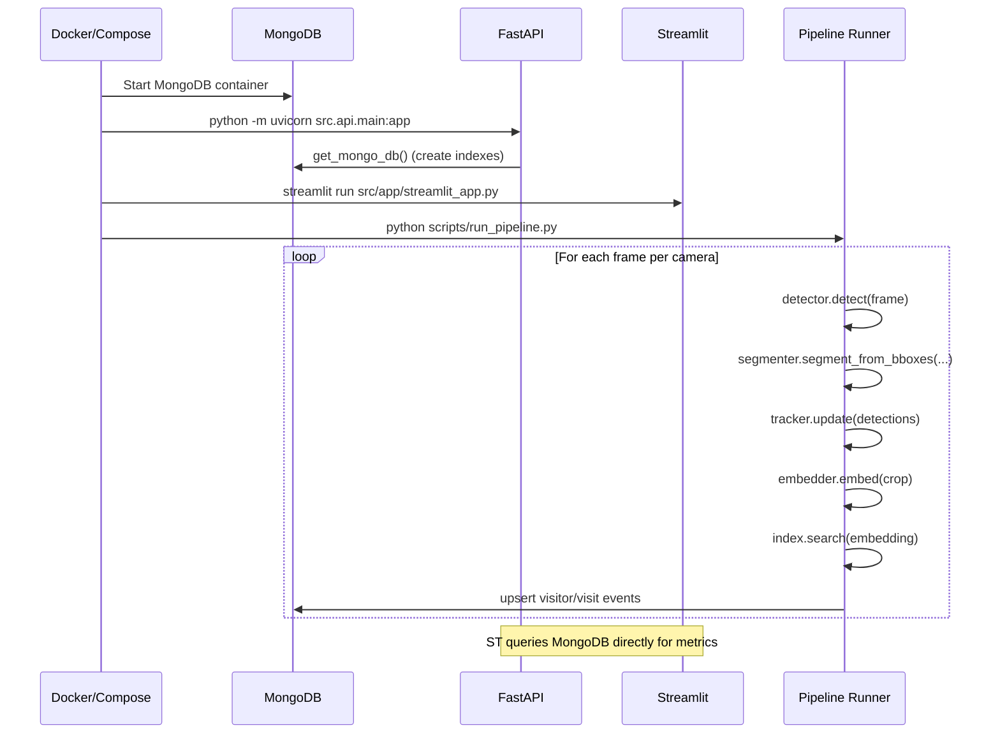

# Retail Analytics Backend Scaffold (YOLOv11 + SAM + ReID)

Backend-focused scaffold for multi-camera retail analytics:
- YOLOv11 person detection
- SAM segmentation
- StrongSORT tracking with appearance features
- Multi-camera ReID with FAISS index (OSNet embedder)
- Time-in/out and zone activity storage (MongoDB)
- FastAPI service (health/stats/analytics)
- Streamlit dashboard (real-time metrics & dwell insights)
- Daily 12 PM IST reset scheduler

Note: Vision modules ship as minimal stubs for wiring. Replace with production models.

## Structure

```
src/
  api/
    main.py                  # FastAPI
  app/
    streamlit_app.py         # Streamlit
  core/
    detection/
      yolo.py                # YOLOv11 wrapper
    segmentation/
      sam.py                 # SAM stub
    tracking/
      tracker.py             # Simple tracker stub
    reid/
      embedding.py           # FAISS index + stub embedder
    pipeline/
      multicam.py            # Multi-camera orchestrator
    storage/
      mongo.py               # MongoDB connection & helpers
scripts/
  run_pipeline.py            # Example pipeline run
  scheduler_reset.py         # Daily reset (12:00 PM IST)
Dockerfile.yolov11           # CPU build with deps
docker-compose.yolov11.yml   # Container runtime
YOLOV11_README.md            # Original YOLOv11 docker usage
```

## Quick Start

1) Container
```bash
docker-compose -f docker-compose.yolov11.yml up -d
```

2) API (0.0.0.0:8000)
```bash
docker-compose -f docker-compose.yolov11.yml exec yolov11 bash -lc "python -m uvicorn src.api.main:app --host 0.0.0.0 --port 8000"
```
Health check:
```bash
curl http://localhost:8000/health
```

3) Streamlit (0.0.0.0:8501)
```bash
docker-compose -f docker-compose.yolov11.yml exec yolov11 bash -lc "streamlit run src/app/streamlit_app.py --server.address 0.0.0.0 --server.port 8501"
```
If not reachable from host, map ports in compose (8000, 8501).

4) Pipeline runner
- Put sample videos in `data/`.
- Edit sources in `scripts/run_pipeline.py` or use RTSP.
```bash
docker-compose -f docker-compose.yolov11.yml exec yolov11 bash -lc "python scripts/run_pipeline.py"
```

5) Daily reset (12 PM IST)
```bash
docker-compose -f docker-compose.yolov11.yml exec yolov11 bash -lc "python scripts/scheduler_reset.py"
```

## Config
- `MONGO_URI` (default `mongodb://mongo:27017`)
- `MONGO_DB` (default `yolov11`)
- `ANALYTICS_API_BASE` for scheduler (default `http://localhost:8000`)
- Expose ports in compose: `8000:8000`, `8501:8501`, `27017:27017`

## Production Upgrades
- Fine-tune ReID thresholds for your environment
- Add zone polygons + heatmap analytics in `pipeline/multicam.py`
- Scale to more cameras with load balancing
- Add GPU support for FastReID (requires Python 3.9 for yacs compatibility)

## Architecture & Flow

### System Data Flow
```mermaid
flowchart LR
    subgraph Cameras
        C1[Camera 1]
        C2[Camera 2]
        Cn[Camera n]
    end

    C1 & C2 & Cn -->|frames| DET[YOLOv11 Detector]
    DET -->|bboxes (persons)| SAM[SAM Segmenter]
    SAM -->|dets + masks| TRK[StrongSORT Tracker]
    TRK -->|local IDs + crops| EMB[OSNet ReID Embedder]
    EMB -->|embeddings| IDX[FAISS ReID Index]
    IDX -->|match global ID| ORCH[Multi-Camera Orchestrator]
    ORCH -->|upsert| DB[(MongoDB)]
    ORCH --> API[FastAPI]
    API --> ST[Streamlit Dashboard]

    subgraph Schedules
        CRON[Daily Reset 12:00 PM IST]
    end
    CRON -->|/reset-daily| API
```

### Startup Sequence

```mermaid
sequenceDiagram
    participant D as Docker/Compose
    participant M as MongoDB
    participant API as FastAPI
    participant ST as Streamlit
    participant P as Pipeline Runner

    D->>M: Start MongoDB container
    D->>API: python -m uvicorn src.api.main:app
    API->>M: get_mongo_db() (create indexes)
    D->>ST: streamlit run src/app/streamlit_app.py
    D->>P: python scripts/run_pipeline.py
    loop For each frame per camera
        P->>P: detector.detect(frame)
        P->>P: segmenter.segment_from_bboxes(...)
        P->>P: tracker.update(detections)
        P->>P: embedder.embed(crop)
        P->>P: index.search(embedding)
        P->>M: upsert visitor/visit events
    end
    Note over API,ST: ST queries MongoDB directly for metrics
```
